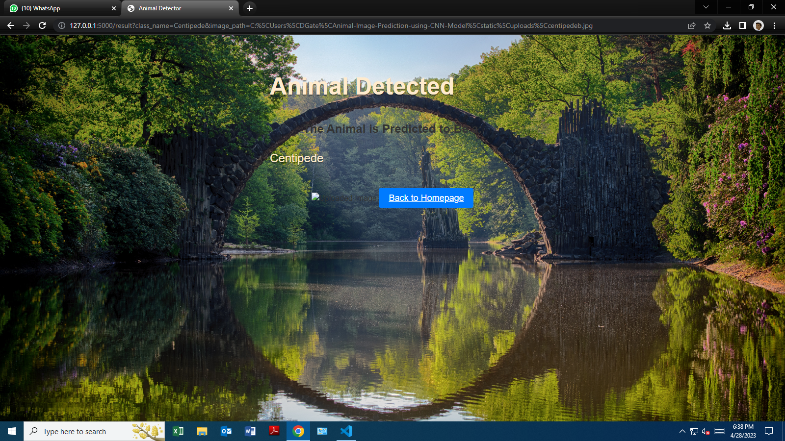

# Animal Image Prediction using CNN Model

This project is designed to identify [80 animals species](animaldict.csv) using Convolutional Neural Network (CNN) models. The model is trained on a dataset containing the species with over 29000 images. 

## Dataset

Check the dataset [here](https://www.kaggle.com/datasets/antoreepjana/animals-detection-images-dataset).
The model is built using TensorFlow and Keras, and the final model is used to predict the animal category based on the input image. The model accuracy is calculated based on the number of correct predictions.

## Requirements

To run this project, you will need to have the following installed:

* dvc
* flask
* joblib
* keras
* numpy
* pandas
* Pillow
* werkzeug
* tensorflow 

## Notebook

The model was trained in the Jupyter notebook which can be found [here](CNN%20Model.ipynb) while the code for the model training [here](CNN%20Model.py). The model was saved in pickle format and tracked using dvc due to the github size limit.

## Flask App

The [flask app](Animal%20Pred%20Flask) has been designed to use the model trained to predict the type of animal in the picture if included in training.

* Input
The app takes only an image file as input.

* Output
The app gives the predicted label or name of the animal and the previous uploaded picture.

## Limitations and Improvements

While the animal image prediction model is running, there are still some limitations that should be considered. These include:

* Restricted to 80 species: The model has been trained on a dataset containing 80 different species of animals, which means that it may not perform well on other species.

* Low accuracy: The current model accuracy is around 24%, which is relatively low. There are several factors that may be contributing to this, such as the size of the dataset and the complexity of the model architecture.

* Future work: There are several areas of potential improvement for this project. These include:

  * Adding more species to the dataset.

  * Optimizing the model architecture.

  * Fine-tuning the model.

## Vercel App
To view the user interface of the flask app, I created a vercel app to showcase that. The model file is larger than limit expected thus app cannot be used for prediction. The link to the Animal Predictor can be found at the project github page or [here][def].

For any improvement don't fail to reach out through.

* 

* 

* 

* 

[def]: https://animalpredictor.vercel.app